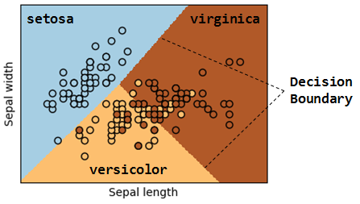

###### 2018.09.25 初稿
## 1.0. 目的
本ブログは、**侵入検知システムの実装**を通して、**ロジスティック回帰**と呼ばれる分類アルゴリズムの**使用方法を理解**することを目的とします。  

## 1.1. 侵入検知
侵入検知（Intrusion Detection）とは、ネットワークやホストへの不正なアクセスを検知する機能です。  
　[Wikipedia](https://ja.wikipedia.org/wiki/%E4%BE%B5%E5%85%A5%E6%A4%9C%E7%9F%A5%E3%82%B7%E3%82%B9%E3%83%86%E3%83%A0)によると、検知の方法は2つに大別されます。  

 * アノマリ型（異常検知型）  
 パケット量や通信の種類といった**特徴に注目**し、正常通信と**特徴が乖離**している場合に不正と見なす。  

 * シグネチャ型  
 パケット内容の**パターンに着目**し、予め用意した侵入検知用の文字列（シグネチャ）にパターンが**合致**した場合に不正と見なす。  

シグネチャ型は機械学習を利用する余地が少ないと考えたため、本ブログでは**アノマリ型**の侵入検知システムを**機械学習で実装**する例を解説します。  


ところで、アノマリ型の侵入検知を実装するためには、観測対象の通信から**不正アクセスの特徴を抽出**し、これを手掛かりに通信を**正常**または**不正**に**分類**すれば良いと考えられます。また、可能であれば、分類時にそのパーセンテージ（**確率**）も併せて計算できた方が運用上は好ましいと言えます。なぜならば、通信には機械的に白黒つけ難い微妙な通信が存在するからです。このような場合は、例えば「分類確率が70%以下の場合は人間の判断を仰ぐ」等のようなルールを決めておくことで、検知漏れを減らすことができます。  

**確率付き**で**データ分類**を行う機械学習アルゴリズムは数多く存在しますが、本ブログでは「**ロジスティック回帰（Logistic Regression）**」と呼ばれるアルゴリズムを採用することにします。  

以下、ロジスティック回帰の簡単な解説を行った後、Pythonを用いて侵入検知システムを実装していきます。  

## 1.2. ロジスティック回帰
ロジスティック回帰は、分類対象のデータに含まれる様々な**特徴を手掛かり**にし、データを**予め定義したクラス（=答え）に分類**するアルゴリズムです。ロジスティック回帰の実行結果は、**予測クラス**と**分類確率**となります。ここで、分類確率は「**0～1の範囲内の数値**」で表現され、例えば分類確率が0.6の場合は、「60%の精度で分類した」と見なすことができます。なお、ロジスティック回帰は**教師あり学習**であり、事前に学習データ（教師データ）と呼ばれる**データセット**を用いて学習させておく必要があります。  

 | 教師あり学習（Supervised Learning）|
 |:--------------------------|
 | **特徴量**と**クラス**をペアにしたデータを基に、「この特徴量の時はこのクラス」というパターンを学習させる手法。|

 | 特徴量（Feature）|
 |:--------------------------|
 | データの特徴を数値で表したもの。|

 | データセット（Data Set）|
 |:--------------------------|
 | 特徴量とクラス（答え）をペアにしたデータ群。データセットの質・量が教師あり学習モデルの分類精度を左右する。セキュリティ系のデータセットでは、有志や企業等が作成したマルウエアデータセットや不正侵入データセット等が有名。|

### 1.2.1. ロジスティック回帰入門
一般公開されている[Iris flower dataset](https://en.wikipedia.org/wiki/Iris_flower_data_set)と呼ばれるデータセットを使用して、ロジスティック回帰を解説します。  

 | Iris flower dataset|
 |:--------------------------|
 | 品種毎に花弁や萼片の長さ、幅が異なるというIris（アヤメという花）の特徴を基に、3品種のIrisのデータを50件ずつ纏めたデータセット。機械学習アルゴリズムの動作確認に使用されることが多い。|

Iris flower datasetには、「setosa」「versicolor」「virginica」の3品種のデータが含まれています。各データは「萼片の長さ（Sepal length）」「萼片の幅（Sepal width）」「花弁の長さ（Petal length）」「花弁の幅（Petal width）」という**4つの特徴量**で構成されています。下表は、Iris flower datasetの一部を示しています。この表から、**品種によって花弁や萼片の幅及び長さが異なる**ことが分かります。例えば、萼片の長さ（Sepal length）は「virginica > versicolor > setosa」の順になっています（単位はcm）。また、萼片の幅（Sepal width）は「(virginica ≒ setosa) > versicolor」の順になっています。  

|Sepal length|Sepal width|Petal length|Petal width|Species|
|:-----------|:----------|:-----------|:----------|:------|
| 5.8 | 4.0 | 1.2 | 0.2 | setosa |
| 5.7 | 3.8 | 1.7 | 0.3 | setosa |
| 7.0 | 3.2 | 4.7 | 1.4 | versicolor |
| 6.9 | 3.1 | 4.9 | 1.5 | versicolor |
| 7.9 | 3.8 | 6.4 | 2.0 | virginica |
| 7.7 | 3.8 | 6.7 | 2.2 | virginica |

このように、品種によって萼片と花弁の長さ及び幅が異なるため、これらIrisの**特徴量をロジスティック回帰で学習**させることで、Irisの品種を分類できる**モデル**を作成することができます。作成したモデルに、（新たに採取した）分類させたいIrisデータを与えることで、モデルは学習結果に基づいて何れかの品種に分類することができます。  

 | モデル（Model）|
 |:--------------------------|
 | 何らかの機械学習アルゴリズムを使用してデータの特徴を学習したもの。|

下記の分類結果は、萼片の長さ・幅の**2つの特徴量**をロジスティック回帰で学習させたモデルを使用し、Iris flower datasetの各データを3品種の何れかに分類した結果を示しています。ここで、ロジスティック回帰では、データの特徴量を基に**決定境界**と呼ばれる**データを分離する直線**を計算し、これを境に各データを分類します。  

 | 決定境界（Decision Boundary）|
 |:--------------------------|
 | 機械学習において、データのクラスを分類する直線。|

　

上記の結果を観察すると、「setosa」のデータは全て正しく分類できていることが分かります。一方、「versicolor」と「virginica」は、幾つかのデータを誤って分類していることが分かります。この誤分類は、分類対象のデータの中に「versicolor」と「virginica」の**特徴量が類似したデータが存在**しているために発生しています。この事実は、**特徴量が類似した品種においては必ずしも全て正しく分類できない**ことを示唆しています。しかし、幾つかの誤分類はあるものの、概ね「versicolor」と「virginica」を分類する決定境界が計算できていることが分かります。  

このように、ロジスティック回帰は**データに含まれる特徴量を捉える**ことで、各データを**何れかのクラスに分類**することができます。なお、本例では説明を簡潔にするために2つの特徴量を使用しましたが、4つ全ての特徴量を使用することもできます。  

### 1.2.2. 【参考情報】ロジスティック回帰の分類確率
ロジスティック回帰は分類の予測結果を**確率**で表現できると言いましたが、この確率はどのようにして計算するのでしょうか？  
上述したように、ロジスティック回帰は分類の予測結果を**0～1の範囲内の数値**で表現します。この時、1は「100%」、0.5は「50%」、0は「0%」等と見なすことができますが、この「1」「0.5」「0」等は、各データがプロットされた座標から決定境界までの距離を基に計算されます。すなわち、決定境界から遠く離れたデータの予測結果は1に近似し、決定境界付近のデータの予測結果は0.5に近似します。当然ながら0.5は「50%」となるため、決定境界を挟んだ2つのクラスのどちらに分類して良いのか確証が持てないことを意味します。よって、ロジスティック回帰を実運用する際は分類確率に閾値を設け、「50%～80%の場合は念のために人間が精査する」等とした方が良いかもしれません。  

※分類確率計算の詳細は、筆者が過去に書いた[ブログ](https://www.mbsd.jp/blog/20170117.html)の「付録A：Binary Logistic Regression」をご参照いただければと思います。  

次節では、ロジスティック回帰を使用した侵入検知システムの構築手順とサンプルコードを解説します。  

## 1.3. 侵入検知システムの実装
ロジスティック回帰を使用し、通信の正常/異常を見分け、異常の場合は**具体的な攻撃の種類を確率付きで求める**ことが可能な侵入検知システムを構築します。  

### 1.3.1. 学習データの準備  
ロジスティック回帰は教師あり学習のため、事前に正常通信や様々な攻撃通信の特徴を含んだ学習データを準備する必要があります。  
本来であれば、自社環境で収集したリアルな通信データを使用することが好ましいですが、本ブログでは一般公開されているデータセット「[KDD Cup 1999 Data](http://kdd.ics.uci.edu/databases/kddcup99/kddcup99.html)」を使用します。  

| KDD Cup 1999 Data|
|:--------------------------|
| 米国の軍事ネットワーク環境でシミュレートされた様々な侵入の痕跡を含んだデータセット。本データセットには、探索/侵入行為及び攻撃行為といった異常な通信と正常通信のデータが大量に収録されている。「KDD-99 The Fifth International Conference on Knowledge Discovery and Data Mining」と呼ばれるコンペで使用されたデータ。|

このデータセットは1999年に作られたものであるため内容は古いですが、正常通信と様々な種類の異常通信が含まれているため、侵入検知システムの学習データとして利用することにしました。  

先ず上記のサイトから[kddcup.data_10_percent.gz](http://kdd.ics.uci.edu/databases/kddcup99/kddcup.data_10_percent.gz)をダウンロードして解凍します。すると、約50万件のデータが収録されたCSV形式のファイル「kddcup.data_10_percent_corrected」が現れます。この状態ではカラム名が無く扱い難いため、カラム名が収録された[kddcup.names](http://kdd.ics.uci.edu/databases/kddcup99/kddcup.names)をダウンロードし、以下のように「kddcup.data_10_percent_corrected」の先頭行にカラム行を追加します。  

```
duration: continuous.,protocol_type: symbolic.,service: symbolic.,flag: symbolic.,src_bytes: continuous.,dst_bytes: continuous.,land: symbolic.,wrong_fragment: continuous.,urgent: continuous.,hot: continuous.,num_failed_logins: continuous.,logged_in: symbolic.,num_compromised: continuous.,root_shell: continuous.,su_attempted: continuous.,num_root: continuous.,num_file_creations: continuous.,num_shells: continuous.,num_access_files: continuous.,num_outbound_cmds: continuous.,is_host_login: symbolic.,is_guest_login: symbolic.,count: continuous.,srv_count: continuous.,serror_rate: continuous.,srv_serror_rate: continuous.,rerror_rate: continuous.,srv_rerror_rate: continuous.,same_srv_rate: continuous.,diff_srv_rate: continuous.,srv_diff_host_rate: continuous.,dst_host_count: continuous.,dst_host_srv_count: continuous.,dst_host_same_srv_rate: continuous.,dst_host_diff_srv_rate: continuous.,dst_host_same_src_port_rate: continuous.,dst_host_srv_diff_host_rate: continuous.,dst_host_serror_rate: continuous.,dst_host_srv_serror_rate: continuous.,dst_host_rerror_rate: continuous.,dst_host_srv_rerror_rate: continuous.
0,tcp,http,SF,181,5450,0,0,0,0,0,1,0,0,0,0,0,0,0,0,0,0,8,8,0,0,0,0,1,0,0,9,9,1,0,0.11,0,0,0,0,0,normal.
0,tcp,http,SF,239,486,0,0,0,0,0,1,0,0,0,0,0,0,0,0,0,0,8,8,0,0,0,0,1,0,0,19,19,1,0,0.05,0,0,0,0,0,normal.
0,tcp,http,SF,235,1337,0,0,0,0,0,1,0,0,0,0,0,0,0,0,0,0,8,8,0,0,0,0,1,0,0,29,29,1,0,0.03,0,0,0,0,0,normal.
0,tcp,http,SF,219,1337,0,0,0,0,0,1,0,0,0,0,0,0,0,0,0,0,6,6,0,0,0,0,1,0,0,39,39,1,0,0.03,0,0,0,0,0,normal.

...snip...

0,tcp,ftp_data,SF,0,5690,0,0,0,0,0,1,0,0,0,0,0,0,0,0,0,0,1,1,0,0,0,0,1,0,0,1,1,1,0,1,0,0,0,0,0,buffer_overflow.
0,tcp,ftp_data,SF,0,5828,0,0,0,0,0,1,0,0,0,0,0,0,0,0,0,0,2,2,0,0,0,0,1,0,0,2,2,1,0,1,0,0,0,0,0,buffer_overflow.
0,tcp,ftp_data,SF,0,5020,0,0,0,0,0,1,0,0,0,0,0,0,0,0,0,0,3,3,0,0,0,0,1,0,0,3,3,1,0,1,0,0,0,0,0,buffer_overflow.
0,tcp,ftp_data,SF,0,2072,0,0,0,1,0,1,0,1,0,0,0,0,0,0,0,0,3,3,0,0,0,0,1,0,0,4,4,1,0,1,0,0,0,0,0,buffer_overflow.

...snip...

0,udp,private,SF,28,0,0,1,0,0,0,0,0,0,0,0,0,0,0,0,0,0,1,1,0,0,0,0,1,0,0,204,1,0,0.05,0,0,0.02,0,0,0,teardrop.
0,udp,private,SF,28,0,0,3,0,0,0,0,0,0,0,0,0,0,0,0,0,0,2,2,0,0,0,0,1,0,0,205,2,0.01,0.05,0.01,0,0.02,0,0,0,teardrop.
0,udp,private,SF,28,0,0,3,0,0,0,0,0,0,0,0,0,0,0,0,0,0,3,3,0,0,0,0,1,0,0,206,3,0.01,0.05,0.01,0,0.02,0,0,0,teardrop.
0,udp,private,SF,28,0,0,3,0,0,0,0,0,0,0,0,0,0,0,0,0,0,4,4,0,0,0,0,1,0,0,207,4,0.02,0.05,0.02,0,0.02,0,0,0,teardrop.
```

これでファイル内容が見易くなりました。  
本ファイルは1行で1つの通信データを表しており、「1～41カラム」は特徴量、「42カラム目」はラベル（通信の種類＝答え）となります。  
※各特徴量の解説は[こちら](http://kdd.ics.uci.edu/databases/kddcup99/task.html)を参照してください。  

なお、ラベルは全23種類存在します。即ち、このデータセットには23種類の通信が含まれています。  
以下に一例を示します。  

| Label           | Description |
|:----------------|:------------|
| normal.         | 正常通信。|
| nmap.           | 異常通信。Nmap実行時のデータ。|
| teardrop.       | 異常通信。DoS（teardrop）実行時のデータ。|
| buffer_overflow.| 異常通信。Buffer Overflow実行時のデータ。|
| guess_password. | 異常通信。パスワード推測実行時のデータ。|

正常通信`normal.`の他に、探索行為に使用される`nmap.`や権限昇格に使われる`buffer_overflow.`等の異常通信のデータが含まれていることが分かります。  

本ブログでは解説を簡潔にするため、学習に使用するラベルを上記の5種類に限定し、それ以外のラベルに紐付くデータは全て削除します。これにより、データ数は約10万件に削減されます。この状態のファイルを学習データ「[kddcup_train.csv](https://github.com/13o-bbr-bbq/machine_learning_security/blob/master/Security_and_MachineLearning/dataset/kddcup_train.csv)」として保存します。  

### 1.3.2. 特徴量の選択  
学習に使用する特徴量を選択します。  
学習データ「kddcup_train.csv」には41種類の特徴量が含まれていますが、通信の分類に貢献しない特徴量を使用した場合、モデルの分類精度が低下する場合があります。  

そこで、41種類の特徴量の中から、侵入検知の対象とする上記5種類の通信（normal, nmap, teardrop, buffer_overflow, guess_password）を**強く特徴付けると考えられる特徴量を選択**します。なお、この行為を**特徴選択**と呼びます。  

| 特徴選択（Feature Selection）|
|:--------------------------|
| モデルの分類性能を高めるために、分類に貢献する特徴量のみを選択する手法。|

例えば、ラベル「teardrop」のデータを眺めてみると、特徴量「wrong_fragment」が他の通信よりも大きいことが分かります。本データセットにおいてwrong_fragmentは「誤りのあるfragment数」を意味しますが、teardrop攻撃は断片化したIPパケットのオフセット情報を偽装し、オフセットが重複したIPパケットを送り付けることで、受信側のシステムをクラッシュさせる攻撃です。この攻撃の特性を鑑みると、teardropの特徴量として「wrong_fragment」を選択する方が良いと考えられます。  

このように、各通信の特性を考慮した上で、1つずつ必要な特徴量を選択していきます。  
今回は以下の特徴量を選択しました。  

| Label           | Feature | Description |
|:----------------|:------------|:------------|
| nmap.           | dst_host_serror_rate | SYNエラー率。 |
|                 | dst_host_same_src_port_rate | 同一ポートに対する接続率。 |
| teardrop.       | wrong_fragment | 誤りのあるfragment数。 |
| buffer_overflow.| duration | ホストへの接続時間（sec）。 |
|                 | logged_in | ログイン成功有無。 |
|                 | root_shell | root shellの取得有無。 |
| guess_password. | dst_host_rerror_rate | REJエラー率。 |
|                 | num_failed_logins | ログイン試行の失敗回数。 |

今回は筆者の主観で特徴選択しましたが、特徴量を分析する手法として**主成分分析**と呼ばれる手法が存在します。本手法の分析精度は対象データの特性に依存しますが、客観的に有効な特徴量を求めるのに役立つ場合があります。

| 主成分分析（Principal Component Analysis：PCA）|
|:--------------------------|
| データの分散（バラつき）が大きい特徴量を検出する。分散の大きな特徴量に着目することで、各データを分類し易くなる。|

なお、特徴選択は**次元削減**（次元圧縮）の効果もあるため、モデルの分類性能の向上や計算量を削減することができます（**次元の呪い**に陥るのを防ぐ）。  

| 次元削減（Dimensionality Reduction）|
|:--------------------------|
| 元の学習データの次元数（特徴量数）をデータの意味を保ったまま削減する手法。データ圧縮による計算量の削減、データの可視化が行い易くなる等の効果が得られる。|

| 次元の呪い（Curse of Dimensionality）|
|:--------------------------|
| 学習データの次元数（特徴量数）が大きくなり過ぎることで、そのデータで表現可能な組み合わせが飛躍的に多くなり、結果的に計算量が指数関数的に大きくなる問題。また、本来不必要な多くの特徴量を使用することで、**過学習**を引き起こす場合もある。|

| 過学習（Overfitting）|
|:--------------------------|
| モデルが学習データに過剰に適合することで、真のモデルから遠ざかってしまうこと（汎化能力の低下）。学習データ以外のデータが与えられた場合、正しく分類できなくなる。|

### 1.3.3. テストデータの準備
侵入検知システムの性能を評価するためのテストデータを準備します。  
ここでも、KDD Cup 1999で公開されているデータを使用します。  

[KDD Cup 1999](http://kdd.ics.uci.edu/databases/kddcup99/kddcup99.html)から[corrected.gz](http://kdd.ics.uci.edu/databases/kddcup99/corrected.gz)をダウンロードして解凍します。すると、約30万件のデータが収録されたCSV形式のファイル「corrected」が現れますが、このファイルにもカラムが無いため、学習データの時と同じ要領でカラムを追加します。そして、侵入検知の対象とする5種類の通信（normal, nmap, teardrop, buffer_overflow, guess_password）のデータのみを残します。これにより、データ数は約6万5千件に削減されます。この状態のファイルをテストデータ「[kddcup_test.csv](https://github.com/13o-bbr-bbq/machine_learning_security/blob/master/Security_and_MachineLearning/dataset/kddcup_test.csv)」として保存します。  

これで、学習データとテストデータの準備が完了しました。  
次節では実際にサンプルコードを実行し、テストデータに含まれる各種攻撃の通信を正しく分類できるのか検証します。  

### 1.3.4. サンプルコード及び実行結果
#### 1.3.4.1. サンプルコード
本ブログではPython3を使用し、簡易的な侵入検知システムを実装しました。  
※本コードは[こちら](https://github.com/13o-bbr-bbq/machine_learning_security/blob/master/Security_and_MachineLearning/src/intrusion_detection.py)から入手できます。  

本システムの大まかな処理フローは以下のとおりです。  

 1. 学習データ及びテストデータのロード
 2. 学習データを使用して学習（モデル作成）
 3. テストデータを使用して侵入検知の可否を観測（モデル評価）
 4. 評価結果の出力

```
#!/bin/env python
# -*- coding: utf-8 -*-
import time
import pandas as pd
import numpy as np
from sklearn import linear_model
from sklearn import metrics

# Load train data
df_train = pd.read_csv('..\\dataset\\kddcup_train.csv')
X_train = df_train.iloc[:, [0, 7, 10, 11, 13, 35, 37, 39]]  # feature(X)
X_train = (X_train - X_train.mean()) / X_train.mean()       # normalization
y_train = df_train.iloc[:, [41]]                            # label(y)

# Load test data
df_test = pd.read_csv('..\\dataset\\kddcup_test.csv')
X_test = df_test.iloc[:, [0, 7, 10, 11, 13, 35, 37, 39]]
X_test = (X_test - X_test.mean()) / X_test.mean()
y_test = df_test.iloc[:, [41]]

# We create an instance of Logistic Regression Classifier.
logreg = linear_model.LogisticRegression(C=1e5)

# Fit (Train)
start = time.perf_counter()
logreg.fit(X_train, y_train)
elapsed_time = time.perf_counter() - start
print('train_time   : {0}'.format(elapsed_time) + ' [sec]')

# Predict for probability and label
start = time.perf_counter()
probs = logreg.predict_proba(X_test)
elapsed_time = time.perf_counter() - start
print('predict_time : {0}'.format(elapsed_time) + ' [sec]')
y_pred = logreg.predict(X_test)

# Evaluation
print('score : {0}'.format(metrics.accuracy_score(y_test, y_pred)))

# Output predict result
print('-' * 60)
print('label\tpredict\tprobability')
idx = 0
for predict, prob in zip(y_pred, probs):
    print('{0}\t{1}\t{2}'.format(y_test.iloc[idx, [0]].values[0], predict, np.max(prob)))
    idx += 1

print('finish!!')
```

#### 1.3.4.2. コード解説
今回はロジスティック回帰の実装に、機械学習ライブラリの**scikit-learn**を使用しました。  
scikit-learnの使用方法は[公式ドキュメント](http://scikit-learn.org/)を参照のこと。

##### パッケージのインポート
```
from sklearn import linear_model
from sklearn import metrics
```

scikit-learnのロジスティック回帰パッケージ「`linear_model`」をインポートします。  
このパッケージには、ロジスティック回帰を行うための様々なクラスが収録されています。  

また、分類精度を評価するためのパッケージ「`metrics`」も併せてインポートします。  

##### 学習データのロード
```
# Load train data
df_train = pd.read_csv('..\\dataset\\kddcup_train.csv')
X_train = df_train.iloc[:, [0, 7, 10, 11, 13, 35, 37, 39]]  # feature(X)
X_train = (X_train - X_train.mean()) / X_train.mean()       # normalization
y_train = df_train.iloc[:, [41]]                            # label(y)
```

学習データ「kddcup_train.csv」から、特徴選択した特徴量に紐付くデータとラベルを取得します（```X_train = df_train.iloc[:, [0, 7, 10, 11, 13, 35, 37, 39]]```、```y_train = df_train.iloc[:, [41]]```）。  
ここで、学習精度を上げるために、各特徴量のデータ値を**正規化**します（```(X_train - X_train.mean()) / X_train.mean()```）。  

| 正規化（Normalization）|
|:--------------------------|
| 尺度が異なるデータ値を```0～1```等の一定の範囲に収まるように加工し、各特徴量の尺度を統一する手法。分類結果が数値的に大きな特徴量に大きく左右されることを防ぐ。正規化することで、学習精度が向上する場合がある。|

##### テストデータのロード
```
# Load test data
df_test = pd.read_csv('..\\dataset\\kddcup_test.csv')
X_test = df_test.iloc[:, [0, 7, 10, 11, 13, 35, 37, 39]]
X_test = (X_test - X_test.mean()) / X_test.mean()
y_test = df_test.iloc[:, [41]]
```

テストデータを学習データと同様に取得します（`X_test`、`y_test`）。  

##### モデルの定義
```
logreg = linear_model.LogisticRegression(C=1e5)
```

`linear_model.LogisticRegression`でロジスティック回帰モデルを定義します。  
なお、引数として渡している「`C=1e5`」は**正則化**強度です。  

| 正則化（Regularization）|
|:--------------------------|
| 機械学習において過学習を抑えるための手法。|

##### モデルの作成（学習の実行）
```
logreg.fit(X_train, y_train)
```

`logreg`の`fit`メソッドの引数として、各特徴量「`X_train`」とラベル「`y_train`」を渡すことで、学習が行われます。これにより、ロジスティック回帰モデルが作成されます。  

##### 分類確率の取得
```
probs = logreg.predict_proba(X_test)
```

モデル`logreg`の`predict_proba`メソッドの引数としてテストデータ「`X_test`」を渡すことで、モデルがテストデータの分類を行い、分類確率「`probs`」を返します。

##### 分類結果の取得
```
y_pred = logreg.predict(X_test)
```

モデル`logreg`の`predict`メソッドの引数としてテストデータ「`X_test`」を渡すことで、モデルがテストデータの分類を行い、分類結果「`y_pred`」を返します。  

##### モデルの評価
```
print('score : {0}'.format(metrics.accuracy_score(y_test, y_pred)))
```

モデルが分類した結果「`y_pred`」と、予め用意したラベル「`y_test`」を`metrics.accuracy_score`メソッドの引数として渡すことで、モデルの分類結果とラベルの一致度合（分類精度）を計測することができます。  

##### 分類結果の出力
```
for predict, prob in zip(y_pred, probs):
    print('{0}\t{1}\t{2}'.format(y_test.iloc[idx, [0]].values[0], predict, np.max(prob)))
    idx += 1
```

「`y_test`」「`y_pred`」「`probs`」を1件ずつコンソール上に出力します。  

#### 1.3.4.3. 実行結果
このサンプルコードを実行すると、以下の結果がコンソール上に出力されます。  

```
train_time   : 10.235417526819267 [sec]
predict_time : 0.023557101303234518 [sec]
score : 0.8996588708933895
------------------------------------------------------------
label             predict         probability
normal.           normal.         0.9998065736764143
normal.           normal.         0.9998065736764143
normal.           normal.         0.9998065736764143
normal.           normal.         0.9917140229898096

...snip...

nmap.             nmap.           0.695479203
nmap.             nmap.           0.695479203
nmap.             nmap.           0.695479203
nmap.             nmap.           0.695479203

...snip...

buffer_overflow.  normal.         0.999980104
buffer_overflow.  guess_passwd.   0.333345516
buffer_overflow.  normal.         0.990855252
buffer_overflow.  guess_passwd.   0.333334087

...snip...

teardrop.         teardrop.       0.999998379
teardrop.         teardrop.       0.500005699
teardrop.         teardrop.       0.500000044
teardrop.         teardrop.       0.999998157

...snip...

guess_passwd.     guess_passwd.   0.478403815
guess_passwd.     guess_passwd.   0.499999391
guess_passwd.     guess_passwd.   0.38504377
guess_passwd.     normal.         0.999790317
```

`score`はモデルの分類精度であり、分類精度は「89.9%」であることを示しています。  
`-----`以下は、通信データ毎の「ラベル、分類結果、分類確率」を出力しています。  

この結果から、「normal」や「nmap」「teardrop」「guess_passwd」は概ね正しく分類できていることが分かります。但し、「nmap」や「teardrop」「guess_passwd」の一部分類確率を見ると、「69%、50%、38%」等のように低い数値になっています。これは、今回筆者が主観で選択した特徴量よりも、**もっと適切な特徴量が存在する可能性**を示唆しています。また、「buffer_overflow」は殆ど正しく分類できておらず、「normal」や「guess_passwd」として誤検知していることが分かります。これは、「buffer_overflow」の**特徴量を見直す必要がある**ことを強く示唆しています。  

## 1.4. おわりに
このように、特徴選択の精度によって分類精度が大きく左右されることが分かって頂けたかと思います（笑）。  
 本ブログでは、KDD Cup 1999のデータセットを学習データとして使用しましたが、実際に収集したリアルなデータを学習に使用する場合は、侵入検知に**役立つ特徴量を見落とさないように、収集する情報を慎重に検討**する必要があります（ここがエンジニアの腕の見せ所だと思います）。  

本ブログを読んでロジスティック回帰にご興味を持たれた方は、ご自身で特徴選択を行ってコードを実行し、検知精度がどのように変化するのかを確認しながら理解を深める事を推奨致します。  

## 1.5. 動作条件
 * Python 3.6.1
 * pandas 0.23.4
 * numpy 1.15.1
 * scikit-learn 0.19.2
