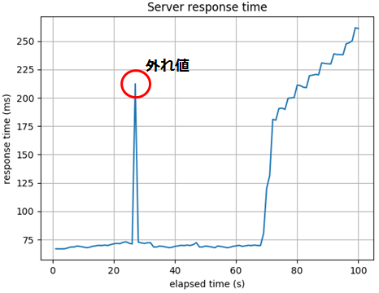
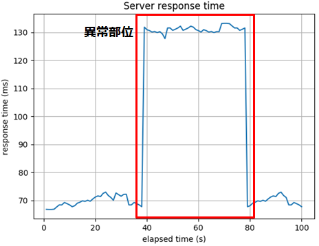
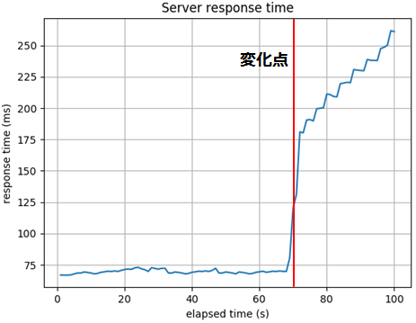
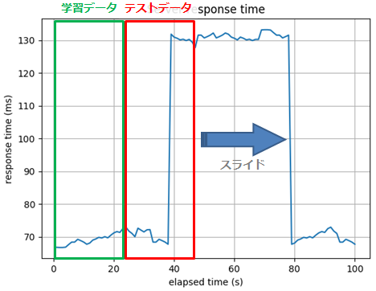

###### 2018.12.30 初稿

## 3.0. 目的
本ブログは、**異常検知システムの実装**を通して、機械学習アルゴリズムの一つである**K近傍法**を理解することを目的としています。  

## 3.1. 異常検知
**異常検知**（Anomaly Detection）とは、ソフトウエアやセンサー等によって収集された膨大なログを基に、**正常時から乖離したデータパターンを即時または事前に検知する技術**です。機器の故障検知やDoS（Denial of Service）の予兆検知、セキュリティ以外の分野では、消費者の購買パターンの変化を捉えてマーケティングに活用する例があります。  

以下に、代表的な異常検知手法を示します。  

 * 外れ値検知  
 通常は起こりえない**データ点**を検知する手法。  
 急激なデータの変化を検知することができる。  

 

 * 異常部位検知  
 異常が起きている**部分時系列**を検知する手法。  
 データ全体の中から異常が発生している部位を検知することができる。  

 

 * 変化点検知  
 時系列データの**パターンが変化する箇所**を検知する手法。  
 データ傾向の変化を検知することができる。  

 

### 3.1.1. 本ブログにおける異常検知のコンセプト
異常検知は様々なタスクに応用できますが、本ブログでは**脆弱性診断対象サーバの異常検知**を例にします。  

脆弱性診断では、複数人または複数スレッドで脆弱性スキャナを実行し、対象サーバに大量のリクエストを送信する場合があります。これにより、何らかの理由で**対象サーバのレスポンス速度が徐々に低下**することがあります。また、場合によっては**対象サーバのレスポンス速度が急激に遅くなる**ことも起こり得ます。  
このような事象を放置していると、対象サーバの動作が不安定になり、最悪の場合ダウンすることも考えられます。  

そこで本ブログでは、**レスポンス速度が徐々に低下**していく事象を**変化点検知**、**サーバのレスポンス速度が急激に遅くなる**事象を**異常部位検知**で検知することにします。そして、これらの異常検知を**K近傍法**と呼ばれるシンプルながら強力な機械学習アルゴリズムで実装します。  

## 3.2. K近傍法（K Nearest Neighbor）入門の入門
K近傍法は、**各データ間の距離**を利用して、データを予め用意したクラスに**分類**するアルゴリズムです。K近傍法では、先ず初めに**様々なクラスに属する学習データをベクトル空間上にプロット**し、分類したい新たなデータが得られたら、その地点から距離が近い順に**K個の学習データを取得**します。そして、取得した**学習データのクラスで多数決**を取り、**最も多いクラスに新たなデータを分類**します。  

 

上記の図は、2つの特徴（X1とX2）を持った2クラスのデータをベクトル空間上にプロットした様子を示しており、**黄色のデータがクラスA**、**青色のデータがクラスB**、**星印のデータが新たに得られた（分類したい）未知のデータ**となります。  

例えば、**K=3**と設定した場合、未知のデータから**距離の近い順**に**3個**のデータを取得します。すると、青色データ（クラスB）が2個、黄色データ（クラスA）が1個となるため、2対1の多数決で「**未知のデータはクラスB**です！」と分類されます。  

次に、**K=6**と設定した場合、未知のデータから**距離の近い順**に**6個**のデータを取得します。すると、黄色データ（クラスA）が4個、青色データ（クラスB）が2個となるため、4対2の多数決で「**未知のデータはクラスA**です！」と分類されます。  

このようにK近傍法では、「**分類したいデータの近くには、どのクラスに属するデータが多いのか？**」という単純なタスクを解くことで、未知のデータを何れかのクラスに分類します。  

ここで注意が必要なのが、設定する**Kの数により分類結果が異なる**ということです。上述したように、K=3の場合はクラスBに分類されましたし、K=6の場合はクラスAに分類されました。よって、K近傍法を使用する際は、学習データの特性を見極めた上で、**Kを適切に設定**することが重要になります。  

なお、本例では、データを2次元（2つの特徴量）のベクトル空間にプロットしましたが、3次元以上（3つ以上の特徴量）のデータでも分類することは可能です。  

以上で、K近傍法入門の入門は終了です。  
次節では、K近傍法を使用した異常検知システムの構築手順と実装コードを解説します。  

## 3.3. 異常検知システムの実装
本ブログでは、以下の機能を持つ異常検知システムを構築します。  

 1.対象サーバの**突然のレスポンス低下**を検知  
 2.対象サーバの**緩やかなレスポンス低下**を検知  

1を**異常部位検知**、2を**変化点検知**で検知することを試みます。  

### 3.3.1. 監視対象のログ
対象サーバの速度低下を検知するためには、対象サーバのレスポンス速度を**リアルタイムで監視**する必要があります。  
本ブログでは、（後述する）脆弱性スキャナを模した検証用クライアントが出力する下記形式のログ（CSV）を監視対象とします。  

```
2018-12-30 07:29:44,814,INFO,Response_time:0.0164491
2018-12-30 07:29:45,332,INFO,Response_time:0.014084399999999997
2018-12-30 07:29:45,860,INFO,Response_time:0.014386599999999916
2018-12-30 07:29:46,391,INFO,Response_time:0.013813999999999993
2018-12-30 07:29:46,911,INFO,Response_time:0.014697999999999656
2018-12-30 07:29:47,440,INFO,Response_time:0.018110800000000093
2018-12-30 07:29:47,957,INFO,Response_time:0.016424299999999725
2018-12-30 07:29:48,485,INFO,Response_time:0.013961099999999949
2018-12-30 07:29:49,001,INFO,Response_time:0.01654800000000023
2018-12-30 07:29:49,519,INFO,Response_time:0.013722800000000035
```

本ログの1,2カラム目は**ログを記録した時刻**（hh:mm:ss.000）、3カラム目はログレベル、4カラム目は**サーバのレスポンス速度**（sec）を表しており、新たに採取されたログはリアルタイムに追記されていきます。  
なお、レスポンス速度は、**検証用クライアントが対象サーバにHTTPリクエストを送信してからレスポンスを受信するまでの時間**としています。  

### 3.3.2. ログの監視方法
監視対象ログのタイムスタンプを一定時間間隔でチェックし、タイムスタンプが更新された場合に新たなログが記録されたと判断します。そして、ログから新たに追加されたレスポンス速度を取得していきます。  

### 3.2.3. 検証用のクライアント/サーバ
本ブログでは簡易的なクライアントとサーバを使用し、**レスポンス速度に様々な変化を付けたログ**をリアルタイムに生成します。  

#### 検証用サーバ  
検証用サーバは、脆弱性診断対象サーバの役割を果たします。  

本サーバはPythonのWebフレームワークである`tornado`で実装しています。  
ポート`8888`で接続を待ち受け、クライアントから送信されるパラメータ「`param`」の値（`normal` or `attack` or `load`）に応じてレスポンス応答時間を調整します。例えば、「`param=normal`」の場合は「`0.01`(sec)」waitした後に応答します。これは、正常時のレスポンス応答時間を再現します。  

一方、「`param=attack`」の場合は、下図のように「`0.5`(sec)」waitした後に応答します。これは、突然のレスポンス低下を再現します。  

 * 「`param=attack`」の応答速度の変化  
   

最後に、「`param=load`」の場合は、下図のように「`0.01`(sec)」ずつwaitの時間を長くしていきます。これは、緩やかなレスポンス低下を再現します。  

 * 「`param=load`」の応答速度の変化  
   

このように検証用サーバのwait時間を調整することで、**突然のレスポンス低下**や**緩やかなレスポンス低下**の事象を再現することができます。  

* 検証用サーバのコード  

```
#!/bin/env python
# -*- coding: utf-8 -*-
import time
import tornado.httpserver
import tornado.ioloop
import tornado.options
import tornado.web
from tornado.options import define, options
define('port', default=8888, help='run on the given port.', type=int)


class WebHandler(tornado.web.RequestHandler):
    base_time = 0.0

    def get(self):
        param = self.get_argument('param')
        # Normal response time.
        if param == 'normal':
            WebHandler.base_time = 0.01
        # Heavy response time.
        if param == 'attack':
            WebHandler.base_time = 0.5
        # Increasing response time.
        if param == 'load':
            WebHandler.base_time += 0.01
        time.sleep(WebHandler.base_time)


if __name__ == '__main__':
    tornado.options.parse_command_line()
    application = tornado.web.Application([(r'/', WebHandler)])
    http_server = tornado.httpserver.HTTPServer(application)
    http_server.listen(options.port)
    tornado.ioloop.IOLoop.instance().start()
```

※検証用サーバは簡易的な実装のため、コード解説は割愛します。  

#### 検証用クライアント  
検証用クライアントは、脆弱性スキャナの役割を果たします。  

本クライアントも`tornado`で実装しています。  
クライアントは検証用サーバにリクエストを送信し、**リクエスト送信からレスポンス受信までの時間を計測**します。そして、この**計測時間をサーバのレスポンス速度としてログ（`server_response.csv`）に記録**します。  

検証用クライアントは、パラメータ「`REQ_MODE`」の設定値に応じて送信するパラメータ値を変化させます。

 * 突然のレスポンス低下の再現  
 「`REQ_MODE=rapidly`」に設定すると、100リクエスト目までは「`param=normal`」（=サーバは「`0.01`(sec)」で応答）、101リクエスト以降は「`param=attack`」（=サーバは「`0.5`(sec)」で応答）となります。これにより、疑似的に**突然のレスポンス低下**を再現します。  

 * 緩やかなレスポンス低下  
 「`REQ_MODE=slowly`」に設定すると、100リクエスト目までは「`param=normal`」、101リクエスト以降は「`param=load`」（=サーバは「`0.01`(sec)」ずつ応答を遅くする）となります。これにより、疑似的に**緩やかなレスポンス低下**を再現します。  

このように「`REQ_MODE`」の値を切り替えることで、様々な異常事象を含んだログを生成することができます。  

 * 検証用クライアントのコード  

```
#!/bin/env python
# -*- coding: utf-8 -*-
import os
import sys
import time
import tornado.httpclient
from logging import getLogger, FileHandler, StreamHandler, Formatter

MAX_COUNT = 300
REQ_MODE = 'rapidly'
WAIT_TIME = 0.5
MODE_N = 'normal'
MODE_A = 'attack'
MODE_L = 'load'
DIR = os.path.dirname(os.path.abspath(__file__))
LOG_NAME = os.path.join(DIR, 'server_response.csv')
TARGET = 'http://127.0.0.1:8888/?param='

if __name__ == '__main__':
    # Setting logger.
    logger = getLogger('LoggingMockClient')
    logger.setLevel(20)
    fh = FileHandler(LOG_NAME)
    logger.addHandler(fh)
    sh = StreamHandler()
    logger.addHandler(sh)
    formatter = Formatter('%(asctime)s,%(levelname)s,%(message)s')
    fh.setFormatter(formatter)
    sh.setFormatter(formatter)

    # Pseudo scan.
    value = ''
    for idx in range(MAX_COUNT):
        if REQ_MODE == 'complex':
            if 0 <= idx < 50:
                value = MODE_N
            elif 50 <= idx < 100:
                value = MODE_A
            elif 100 <= idx < 200:
                value = MODE_N
            elif 200 <= idx:
                value = MODE_L
        elif REQ_MODE == 'rapidly':
            if 0 <= idx < 100:
                value = MODE_N
            else:
                value = MODE_A
        elif REQ_MODE == 'slowly':
            if 0 <= idx < 100:
                value = MODE_N
            else:
                value = MODE_L
        else:
            print('Invalid mode.')
            sys.exit(1)

        # Send request, measure response time.
        http_client = tornado.httpclient.HTTPClient()
        start = time.perf_counter()
        response = http_client.fetch(TARGET + value)
        elapsed_time = time.perf_counter() - start
        http_client.close()

        # Logging.
        logger.log(20, 'Response_time:' + str(elapsed_time))

        time.sleep(WAIT_TIME)

    print('finish!!')
```

※検証用クライアントは簡易的な実装のため、コード解説は割愛します。  

### 3.2.4. K近傍法による異常検知
K近傍法では**学習データと新たなデータ（以下、テストデータ）の距離を計算**することでクラス分類します。  
ここで、本タスクにおけるクラスと学習データ・テストデータを以下のように整理します。  

 * クラス  
 今回はサーバのレスポンスが**異常か否か**を検知したい。  
 よって、クラスは**正常**または**異常**の2クラスとする。  

 * 学習データ/テストデータ  
 下図のように、**古い部分時系列を学習データ**、**新しい部分時系列をテストデータ**とする。  
 リアルタイムに異常検知を行うために、学習データの部分時系列とテストデータの部分時系列をそれぞれ抽出し、各部分時系列の距離を計算。  
 **2つの距離が近い場合は正常**、**距離が遠い場合は異常**とする。  

　

 ここで重要なのが、部分時系列に含めるデータ数、すなわち**ウィンドウサイズ**です。**ウィンドウサイズが小さい場合は細かな変化を検知できますが、ノイズを拾い易くなります**（False Positive）。一方、**ウィンドウサイズが大きい場合はノイズの影響を緩和できる反面、微妙な変化を見逃す可能性が高まります**（False Negative）。このことから、K近傍法を使って異常検知を行う場合は、**監視対象のデータ特性に合わせて適切なウィンドウサイズを設定**することが重要です。  

なお、リアルタイムに異常検知を行う場合は、新たなデータが得られる度に学習データとテストデータのウィンドウを時系列方向にスライドさせていきます。  

これで、監視対象ログの準備と異常検知の方法が整いました。  
次節では実際にサンプルコードを実行し、対象サーバの異常を検知できるのか検証します。  

### 3.2.5. サンプルコード及び実行結果
#### 3.2.5.1. サンプルコード
本ブログではPython3を使用し、簡易的な異常検知システムを実装しました。  
本システムの大まかな処理フローは以下のとおりです。  

 1. ログの監視
 2. ログからレスポンス速度を取得
 3. K近傍法による異常検知

```
#!/bin/env python
# -*- coding: utf-8 -*-
import os
import time
import datetime
import codecs
import re
import numpy as np
from stat import *
from sklearn.neighbors import NearestNeighbors

# Anomaly detection parameters.
WINDOW_SIZE = 10
RATE_WARNING = 0.5
RATE_ERROR = 0.8
MSG_WARNING = 'Warning'
MSG_ERROR = 'Error'
K = 1

# Surveillance directory and file.
DIR = os.path.dirname(os.path.abspath(__file__))
TARGET_LOG = 'server_response.csv'

# Regulation of Window slide.
max_count = 0
old_count = 0


# Monitor log files.
def watch():
    # Get first timestamp.
    timestamp = time.mktime(datetime.datetime.now().utctimetuple())
    while True:
        for file in os.listdir(DIR):
            if TARGET_LOG in file:
                # Check updated date of target log.
                target_file = os.path.join(DIR, file)
                file_timestamp = os.stat(target_file)[ST_MTIME]
                if timestamp < file_timestamp:
                    # Update timestamp.
                    timestamp = file_timestamp

                    # Read log.
                    fin = codecs.open(target_file, encoding='utf-8')
                    content = fin.read()
                    fin.close()

                    # Judgement.
                    check_logs(content)
        # Wait.
        time.sleep(0.5)


# Judgement of anomaly detection.
def check_logs(content):
    global max_count
    global old_count
    # Extract response time from log.
    all_res_time = re.findall('Response_time\:(\d{1,100}\.\d{1,100})*', content)
    if len(all_res_time) == 0:
        return

    all_res_time = list(map(float, all_res_time))
    response_time = all_res_time[old_count:]
    response_time = list(map(float, response_time))
    max_count = len(all_res_time)

    # Anomaly detection
    if len(all_res_time) > 0:
        # Abnormal part detection.
        anomaly_detection(response_time)


# Select log step by window size.
def emb(lst, dim):
    emb = np.empty((0, dim), float)
    for idx in range(len(lst) - dim + 1):
        tmp = np.array(lst[idx: idx + dim])[::-1].reshape((1, -1))
        emb = np.append(emb, tmp, axis=0)
    return emb


# Anomaly detection using K-NearestNeighbors.
def anomaly_detection(res_time):
    global max_count
    global old_count
    if len(res_time) < WINDOW_SIZE * 2:
        return

    # Get train data.
    train_data = res_time[0: WINDOW_SIZE]
    train = emb(train_data, WINDOW_SIZE)

    # Get test data.
    test_data = res_time[len(train_data): max_count]
    test = emb(test_data, WINDOW_SIZE)
    old_count += WINDOW_SIZE

    # Fit.
    clf = NearestNeighbors(n_neighbors=K)
    clf.fit(train)

    # Calculate distances.
    distances = clf.kneighbors(test)[0]

    # Judge anomaly detection.
    for d in distances:
        now_date = str(datetime.datetime.now().strftime('%H:%M:%S.%f')[:-3])
        print('Distance: {}'.format(d[0]))
        if RATE_WARNING <= d[0] < RATE_ERROR:
            ''' Any notice. ex) posting slack, sending email and terminate scanner. '''
            print('WARNING: Detact anomaly!! Now date: {}'.format(now_date))
        elif RATE_ERROR <= d[0]:
            ''' Any notice. ex) posting slack, sending email and terminate scanner. '''
            print('ERROR: Detact anomaly!! Now date: {}'.format(now_date))


if __name__ == '__main__':
    watch()
```

#### 3.2.5.2. コード解説
今回はK近傍法の実装に、機械学習ライブラリの**scikit-learn**を使用しました。  
※scikit-learnの使用方法は[公式ドキュメント](http://scikit-learn.org/stable/)を参照のこと。  

##### パッケージのインポート
```
from sklearn.neighbors import NearestNeighbors
```

scikit-learnのK近傍法パッケージ「`NearestNeighbors`」をインポートします。  
このパッケージには、K近傍法で分類を行うためのクラスが収録されています。  

##### ログの監視
```
# Surveillance directory and file.
DIR = os.path.dirname(os.path.abspath(__file__))
TARGET_LOG = 'server_response.csv'

...snip...

# Monitor log files.
def watch():
    # Get first timestamp.
    timestamp = time.mktime(datetime.datetime.now().utctimetuple())
    while True:
        for file in os.listdir(DIR):
            if TARGET_LOG in file:
                # Check updated date of target log.
                target_file = os.path.join(DIR, file)
                file_timestamp = os.stat(target_file)[ST_MTIME]
                if timestamp < file_timestamp:
                    # Update timestamp.
                    timestamp = file_timestamp

                    # Read log.
                    fin = codecs.open(target_file, encoding='utf-8')
                    content = fin.read()
                    fin.close()

                    # Judgement.
                    check_logs(content)
        # Wait.
        time.sleep(0.5)
```

検証用クライアントが出力するログ`server_response.csv`のタイムスタンプを`0.5`(sec)間隔でチェックします（`file_timestamp = os.stat(target_file)[ST_MTIME]`）。タイムスタンプが更新されていた場合（＝新たなログが書き込まれた）、ログを読み込んだ上で（`content = fin.read()`）、異常検知用のメソッド「`check_logs`」を呼び出します。  

##### 学習データとテストデータのロード
```
WINDOW_SIZE = 10

...snip...

# Get train data.
train_data = res_time[0: WINDOW_SIZE]
train = emb(train_data, WINDOW_SIZE)

# Get test data.
test_data = res_time[len(train_data): max_count]
test = emb(test_data, WINDOW_SIZE)
old_count += WINDOW_SIZE
```

新たなデータ（`res_time`）が得られたら、学習データとテストデータの部分時系列を**重複しないように抽出**します。今回はウィンドウサイズを10（`WINDOW_SIZE = 10`）に設定したため、学習データとテストデータは**10次元のデータ**になります。  

##### モデルの作成と学習の実行
```
K = 1

...snip...

# Fit.
clf = NearestNeighbors(n_neighbors=K)
clf.fit(train)
```

scikit-learnのK近傍法用クラス「`NearestNeighbors`」でK近傍法モデルを作成します。  
今回は学習データとテストデータの部分時系列間の距離を計算するため、**Kは1**としています。  
そして、学習データ「`train`」を`fit`に渡すことで、学習済みモデルが作成されます。  

##### 学習データとテストデータ間の距離を計算
```
# Calculate distances.
distances = clf.kneighbors(test)[0]
```

作成したK近傍法モデル「`clf`」にテストデータ「`test`」を渡すことで、**学習データとテストデータの部分時系列間の距離**「`distances`」を得ることができます。  

##### 異常の判定
```
RATE_WARNING = 0.5
RATE_ERROR = 0.8

...snip...

# Judge anomaly detection.
for d in distances:
    now_date = str(datetime.datetime.now().strftime('%H:%M:%S.%f')[:-3])
    print('Distance: {}'.format(d[0]))
    if RATE_WARNING <= d[0] < RATE_ERROR:
        ''' Any notice. ex) posting slack, sending email and terminate scanner. '''
        print('WARNING: Detact anomaly!! Now date: {}'.format(now_date))
    elif RATE_ERROR <= d[0]:
        ''' Any notice. ex) posting slack, sending email and terminate scanner. '''
        print('ERROR: Detact anomaly!! Now date: {}'.format(now_date))
```

**予め定義した閾値（`RATE_WARNING`、`RATE_ERROR`）とK近傍法で計算した距離を比較**して任意の処理を行います。  
今回は、異常を検知した場合、現在の時刻`now_date`と検知した旨のメッセージを標準出力するのみですが、実践する場合は「Slackに通知する」「メールを送る」「ネットワーク監視灯を回す」等とするのが良いかもしれません。  

なお、閾値（`RATE_WARNING`、`RATE_ERROR`）は筆者の経験則から、距離が`RATE_WARNING = 0.5`以上の場合は**警告**、`RATE_ERROR = 0.8`以上の場合は**異常検知**としています。  

#### 3.2.5.3. 実行結果
それでは早速実行してみましょう。  

##### 検証用サーバの起動
```
PS C:\Security_and_MachineLearning\src> python mock_server.py
```

初めに検証用サーバを起動します。  
ポート`8888`で検証用クライアントからのリクエストを待ち受けます。  

##### 異常検知システムの起動
```
PS C:\Security_and_MachineLearning\src> python anomaly_detection.py
```

異常検知システムを起動します。  
検証用クライアントが出力するログ「`server_response.csv`」の監視が始まります。  

##### 検証用クライアントの起動
```
PS C:\Security_and_MachineLearning\src> python mock_client.py
```

検証用クライアントを起動します。  
すると、`server_response.csv`には以下のようなログが記録されていきます。  

```
2018-12-30 07:29:44,814,INFO,Response_time:0.0164491
2018-12-30 07:29:45,332,INFO,Response_time:0.014084399999999997
2018-12-30 07:29:45,860,INFO,Response_time:0.014386599999999916
2018-12-30 07:29:46,391,INFO,Response_time:0.013813999999999993
2018-12-30 07:29:46,911,INFO,Response_time:0.014697999999999656
2018-12-30 07:29:47,440,INFO,Response_time:0.018110800000000093
2018-12-30 07:29:47,957,INFO,Response_time:0.016424299999999725
2018-12-30 07:29:48,485,INFO,Response_time:0.013961099999999949
2018-12-30 07:29:49,001,INFO,Response_time:0.01654800000000023
2018-12-30 07:29:49,519,INFO,Response_time:0.013722800000000035

...snip...
```

第1,2カラムはタイムスタンプ、第3カラムはログレベル、第4カラムは検証用サーバの応答時間（sec）です。  

#### 実行結果: 突然のレスポンス低下の検知
検証用クライアントを「`REQ_MODE=rapidly`」で起動すると、検証用サーバは「100リクエスト目までは正常応答（`0.01`(sec)）」、101リクエスト以降は「`0.5`(sec)」で応答します。この時、`server_response.csv`には以下のようなログが記録されていきます。  

```
...snip...

2018-12-30 07:30:31,958,INFO,Response_time:0.014330299999997465
2018-12-30 07:30:32,487,INFO,Response_time:0.01846880000000084
2018-12-30 07:30:33,004,INFO,Response_time:0.014029600000000642
2018-12-30 07:30:33,532,INFO,Response_time:0.01421770000000322
2018-12-30 07:30:34,063,INFO,Response_time:0.01708370000000059
2018-12-30 07:30:34,593,INFO,Response_time:0.015704300000003002
2018-12-30 07:30:35,110,INFO,Response_time:0.016590200000003108
2018-12-30 07:30:35,629,INFO,Response_time:0.014184300000003702
2018-12-30 07:30:36,146,INFO,Response_time:0.014115500000002612
2018-12-30 07:30:36,673,INFO,Response_time:0.014028799999998398
2018-12-30 07:30:37,692,INFO,Response_time:0.5101834000000025
2018-12-30 07:30:38,708,INFO,Response_time:0.5043732000000034
2018-12-30 07:30:39,723,INFO,Response_time:0.5143308999999974
2018-12-30 07:30:40,736,INFO,Response_time:0.5080477000000059
2018-12-30 07:30:41,752,INFO,Response_time:0.5164144000000022
2018-12-30 07:30:42,783,INFO,Response_time:0.5185948999999965
2018-12-30 07:30:43,800,INFO,Response_time:0.5016277999999943
2018-12-30 07:30:44,814,INFO,Response_time:0.5136845000000037
2018-12-30 07:30:45,830,INFO,Response_time:0.5141901000000004
2018-12-30 07:30:46,849,INFO,Response_time:0.5067823999999987
2018-12-30 07:30:47,865,INFO,Response_time:0.5071737000000027
2018-12-30 07:30:48,876,INFO,Response_time:0.5132640999999936
2018-12-30 07:30:49,878,INFO,Response_time:0.5005813999999873

...snip...
```

検証用クライアントの起動から約100秒後（100リクエスト目）となる`2018-12-30 07:30:37,692`から**急激に応答時間が遅くなっている**ことが分かります。  
これをグラフ化すると以下のようになります。  

   

よって、異常検知システムは`epalsed time=100 (s)`あたりで異常を検知することが期待されます。  
以下は異常検知システムの実行結果です。  

```
...snip...

Distance: 0.004443113248609957
Distance: 0.006063399700668682
Distance: 0.5004788605536589
WARNING: Detact anomaly!! Now date: 07:22:38.180
Distance: 1.5477383966711726
ERROR: Detact anomaly!! Now date: 07:30:47.889

...snip...
```

**異常発生から数秒後に警告**を発し、その後、正しく**異常を検知**できている事が分かります。  
また、`Distance`を見ると、異常発生時は学習データとテストデータ間の距離が大きく離れていることも見て取れます。  

この結果から、異常検知システムは**突然のレスポンス低下を正しく検知**できることが分かりました。  

#### 実行結果: 緩やかなレスポンス低下の検知
検証用クライアントを「`REQ_MODE=slowly`」で起動すると、検証用サーバは「100リクエスト目までは正常応答（`0.01`(sec)）」、101リクエスト以降は「`0.01`(sec)」ずつ応答時間を遅くしていきます。  

ここで、「緩やかなレスポンス低下」は「急激なレスポンス低下」と比べて、**学習データとテストデータの距離が小さくなる**ことが予想されます。  
よって、`anomaly_detection.py`の異常検知率を以下のように調整します。  

```
RATE_WARNING = 0.1
RATE_ERROR = 0.3
```

検証用クライアントを起動すると、`server_response.csv`には以下のようなログが記録されていきます。  

```
...snip...

2018-12-30 08:21:15,160,INFO,Response_time:0.015146200000003773
2018-12-30 08:21:15,679,INFO,Response_time:0.015099899999995614
2018-12-30 08:21:16,195,INFO,Response_time:0.013938299999999515
2018-12-30 08:21:16,712,INFO,Response_time:0.014071500000000015
2018-12-30 08:21:17,246,INFO,Response_time:0.028267899999995905
2018-12-30 08:21:17,788,INFO,Response_time:0.03817870000000312
2018-12-30 08:21:18,334,INFO,Response_time:0.042391500000000804
2018-12-30 08:21:18,892,INFO,Response_time:0.05415160000000441
2018-12-30 08:21:19,458,INFO,Response_time:0.06434110000000004
2018-12-30 08:21:20,039,INFO,Response_time:0.07634489999999516
2018-12-30 08:21:20,631,INFO,Response_time:0.08704780000000056
2018-12-30 08:21:21,240,INFO,Response_time:0.10168390000000471
2018-12-30 08:21:21,852,INFO,Response_time:0.10622299999999996
2018-12-30 08:21:22,477,INFO,Response_time:0.11759939999999602
2018-12-30 08:21:23,106,INFO,Response_time:0.12530290000000122
2018-12-30 08:21:23,748,INFO,Response_time:0.13735649999999566

...snip...
```

検証用クライアントの起動から約100秒後（100リクエスト目）となる`2018-12-30 08:21:16,195`から**徐々に応答時間が遅くなっている**ことが分かります。  
これをグラフ化すると以下のようになります。  

   

よって、異常検知システムは`epalsed time=100 (s)`あたりで異常を検知することが期待されます。  
以下は異常検知システムの実行結果です。  

```
...snip...

Distance: 0.0039961307386050205
Distance: 0.002872048270837808
Distance: 0.003979655197377277
Distance: 0.004853363488347499
Distance: 0.0060521305512990665
Distance: 0.20674834157983144
WARNING: Detact anomaly!! Now date: 08:21:22.928
Distance: 0.3171006751372955
ERROR: Detact anomaly!! Now date: 08:21:29.617

...snip...
```

**異常発生から数秒後に警告**を発し、その後、正しく**異常を検知**できている事が分かります。  
また、`Distance`を見ると、異常発生時は学習データとテストデータ間の距離が大きく離れていることも見て取れます。  

この結果から、異常検知システムは**緩やかなレスポンス低下を正しく検知**できることが分かりました。  

## 3.3. おわりに
非常に簡易的な実装であるものの、K近傍法を使うことで異常検知システムを実装できることが分かりました。  
本ブログでは脆弱性診断対象サーバのレスポンス低下検知を例にしましたが、世の中には異常検知のタスクは多く存在します。K近傍法は手軽に実装ができ、かつ処理速度も速いため、ご興味を持たれた方がおりましたら、身近にある様々な異常検知タスクに利用してみる事をお勧めします。  

## 3.4. 動作条件
 * Python 3.6.1（Anaconda3）
 * tornado==4.4.2
 * numpy==1.15.4
 * scikit-learn==0.20.2
